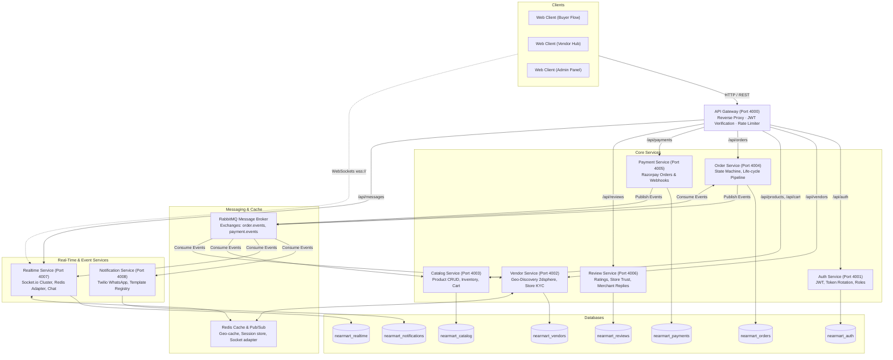
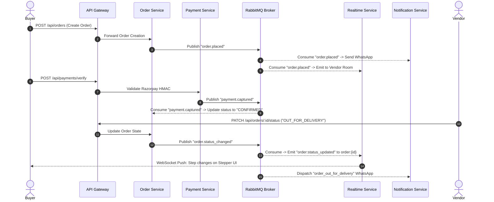
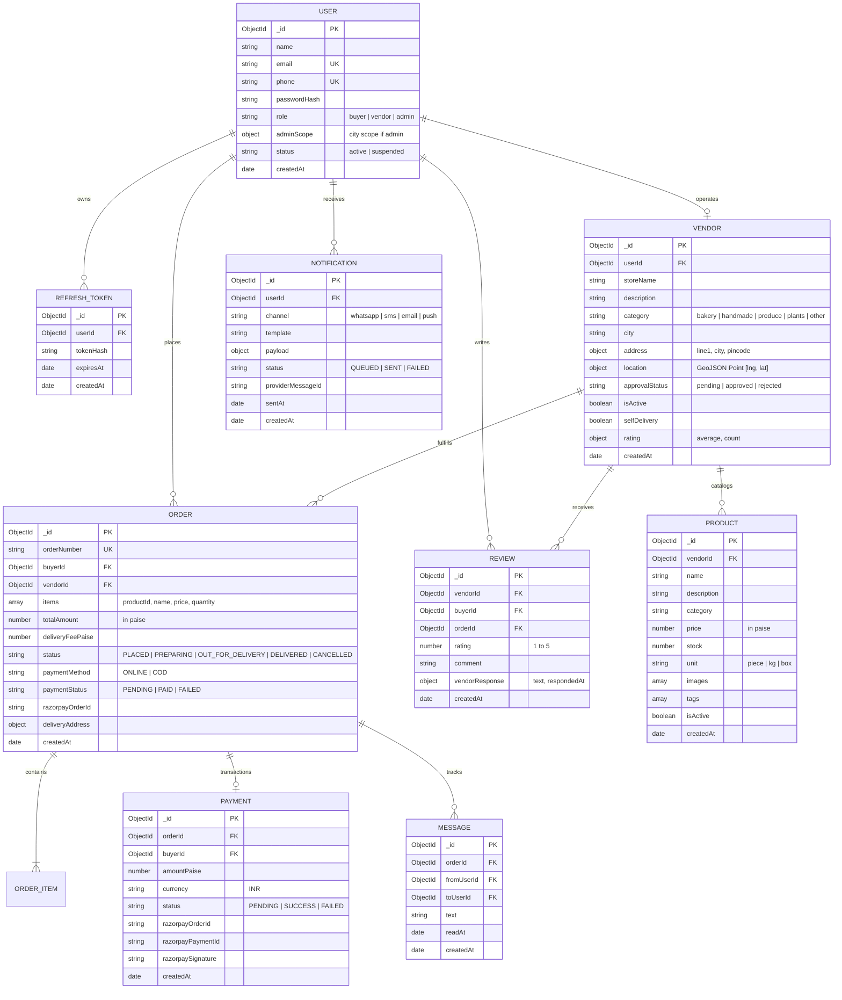

# NearMart — Hyperlocal E-Commerce Platform
### Architecture, Technology Stack, System Workflows, Schemas & Entity-Relationship (ER) Documentation

---

## 1. Executive Summary

**NearMart** is an enterprise-grade, distributed hyperlocal commerce platform engineered to connect neighborhood artisans, bakeries, indie roasters, urban growers, and specialty makers directly with nearby consumers for rapid local delivery.

Unlike traditional broad-market e-commerce, NearMart is architected around **geospatial proximity** (sub-50ms radius queries), **event-driven asynchronous workflows**, **real-time bi-directional synchronization**, and a **Shopify-inspired cinematic dark canvas design system**.

---

## 2. System Architecture

NearMart utilizes a decoupled **Microservices Architecture** orchestrated through an **API Gateway (Reverse Proxy)** with an **Asynchronous Event-Driven Messaging Bus (RabbitMQ)** and a **Shared In-Memory Cache/Adapter Layer (Redis)**.



---

## 3. Technology Stack & Tech Utilization

| Technology | Layer | Role in NearMart | Why it Was Chosen |
| :--- | :--- | :--- | :--- |
| **Node.js & Express** | Backend Services & Gateway | Powers the API Gateway and all 8 microservices | Non-blocking asynchronous I/O, lightweight footprint, robust HTTP routing ecosystem. |
| **React 19 & Vite** | Frontend Client | Drives the buyer experience, vendor workspace, and admin moderation portal | Ultra-fast HMR build speeds, component modularity, modern Hooks state model. |
| **Vanilla CSS (Shopify Design System)** | UI Styling Architecture | Defines tokens, elevations (Level 1/2/3), pill buttons, thin typography | 100% control without CSS framework overhead; strictly enforces Shopify design constraints. |
| **MongoDB & Mongoose** | Primary Persistence | Per-service isolated database instances (`nearmart_*`) | Native JSON-like document flexibility; built-in geospatial `$near` spatial index support. |
| **Redis & ioredis** | In-Memory Cache & Adapter | Caches vendor geo-queries, flushes on updates, connects Socket.io adapter | Microsecond latency, distributed pub/sub, prevents database bottlenecks during surges. |
| **RabbitMQ & amqplib** | Event Message Broker | Asynchronous decoupled message passing across microservices | Guarantees at-least-once message delivery, durable queues, prevents cascading failure. |
| **Socket.io & Redis Adapter** | Real-Time Engine | Powers live order state updates and bi-directional customer-to-vendor messaging | Room-based isolation (`order:{id}`, `user:{id}`) horizontally scalable across nodes. |
| **Razorpay SDK & Webhooks** | Payment Processing | Generates checkout orders and verifies signatures with HMAC-SHA256 | Compliant Indian payment rails (UPI, cards, netbanking) with asynchronous webhook confirmation. |
| **Twilio API** | Outbound Notifications | Dispatches automated WhatsApp and SMS template alerts to buyers and vendors | Reliable global delivery for transactional milestones (e.g., order placed, out for delivery). |
| **JWT & bcryptjs** | Authentication & Security | Stateless access tokens (15m TTL), refresh token rotation (7d TTL), salted password hashing | Industry-standard role-gated protection (`buyer`, `vendor`, `admin`) across all gateways. |
| **Docker & Docker Compose** | Infrastructure & Orchestration | Spins up containerized MongoDB, Redis, and RabbitMQ instances | One-command reproducible local and staging infrastructure setup. |

---

## 4. End-to-End System Workflows

### 4.1 Buyer Discovery to Order Delivery Flow
1. **Location Resolution**: Buyer loads home page; browser requests geolocation coordinates (`lng`, `lat`). If granted, client calls `GET /api/vendors/nearby?lng=...&lat=...`. If denied, buyer selects city from manual dropdown.
2. **Catalog Browsing**: Buyer clicks merchant card → requests `GET /api/vendors/:id` and `GET /api/products?vendorId=...`.
3. **Cart Assembly**: Adding items hits `POST /api/cart/items`. Cart operations validate merchant consistency (one vendor per order).
4. **Checkout**: Buyer inputs delivery address, selects **ONLINE** (Razorpay) or **COD**, and submits `POST /api/orders`.
5. **Payment Authorization**: For online orders, Razorpay Checkout widget initializes. Upon capture, webhook hits `POST /api/payments/webhook` with HMAC signature verification.
6. **Live Tracking**: Client navigates to `/tracking/:orderId`, establishing a WebSocket connection to `realtime-service` (`ws://localhost:4007`). Client joins room `order:{orderId}` to receive status changes (`PLACED` → `PREPARING` → `OUT_FOR_DELIVERY` → `DELIVERED`).

### 4.2 Vendor Store Management & Kanban Inbox
1. **Onboarding**: Merchant signs up with `role: "vendor"`, submits store KYC profile via `POST /api/vendors`. Store defaults to `approvalStatus: "pending"`.
2. **Product Management**: Vendor manages catalog via `ProductManagement.jsx` (`POST/PATCH/DELETE /api/products`).
3. **Order Inbox**: `OrderInbox.jsx` polls and listens to orders. Orders appear under the 4-column Kanban board. Vendor advances state by clicking progression pills (`PATCH /api/orders/:id/status`).
4. **Store Settings**: Vendor toggles `isActive` status or `selfDelivery` via pure CSS toggle switches (`PATCH /api/vendors/me`).

### 4.3 Admin Moderation & City Governance
1. **Role Gating**: Admin signs in with `role: "admin"` (e.g., `admin@nearmart.com`).
2. **Pending Queue**: Admins view unapproved stores filtered by city scope (`GET /api/vendors/pending?city=...`).
3. **Verification Decision**:
   - **Approve**: Hits `PATCH /api/vendors/:id/approve`. Vendor `approvalStatus` becomes `approved` and is immediately indexed for buyer discovery.
   - **Reject**: Admin supplies rejection reason via modal (`PATCH /api/vendors/:id/reject`). Store is rejected and vendor notified.
4. **Platform Analytics**: Admin inspects real-time GMV, order volume, and active merchant metrics.

---

## 5. Event-Driven Message Flow (RabbitMQ)



---

## 6. Entity-Relationship (ER) Diagram



---

## 7. Database Schemas Breakdown

### 7.1 Database: `nearmart_auth`
* **Collection `users`**: Stores authentication credentials, identity, contact information, role mapping (`buyer`, `vendor`, `admin`), and city scope.
  * Indices: `{ email: 1 }` (unique), `{ phone: 1 }` (unique).
* **Collection `refresh_tokens`**: Stores hashed refresh tokens with automatic MongoDB TTL expiration index.
  * Indices: `{ expiresAt: 1 }` (`expireAfterSeconds: 0`), `{ userId: 1 }`.

### 7.2 Database: `nearmart_vendors`
* **Collection `vendors`**: Stores merchant store information, address, operating flags (`isActive`, `selfDelivery`), and GeoJSON Point coordinates.
  * Indices: `{ location: "2dsphere" }` (for `$near` spatial discovery), `{ city: 1, approvalStatus: 1 }`, `{ userId: 1 }`.

### 7.3 Database: `nearmart_catalog`
* **Collection `products`**: Stores inventory items, pricing in paise (to eliminate floating-point math rounding errors), units, image arrays, and categories.
  * Indices: `{ vendorId: 1, isActive: 1 }`, `{ name: "text", description: "text" }` (full-text search).
* **Collection `carts`** (Redis Keyed): Transient shopping cart states mapped per user (`cart:{userId}`) with TTL.

### 7.4 Database: `nearmart_orders`
* **Collection `orders`**: Manages order progression state machine, snapshot items, amounts, delivery addresses, and payment linkage.
  * Indices: `{ buyerId: 1, createdAt: -1 }`, `{ vendorId: 1, status: 1 }`, `{ orderNumber: 1 }` (unique).

### 7.5 Database: `nearmart_payments`
* **Collection `payments`**: Stores transaction logs, Razorpay order and payment IDs, signature audits, and webhook verification statuses.
  * Indices: `{ orderId: 1 }`, `{ razorpayOrderId: 1 }`.

### 7.6 Database: `nearmart_reviews`
* **Collection `reviews`**: Stores 1-to-5 star customer feedback, text reviews, and vendor public replies.
  * Indices: `{ vendorId: 1, createdAt: -1 }`, `{ orderId: 1 }` (unique).

### 7.7 Database: `nearmart_realtime`
* **Collection `messages`**: Stores chat history between customer and merchant scoped by order ID.
  * Indices: `{ orderId: 1, createdAt: 1 }`.

### 7.8 Database: `nearmart_notifications`
* **Collection `notifications`**: Transactional outbox logging dispatched WhatsApp and SMS provider messages.
  * Indices: `{ userId: 1, createdAt: -1 }`.

---

## 8. API Gateway Routing Table

All inbound client requests route through the Gateway at `http://localhost:4000/api`.

| Route Pattern | Target Microservice | Authentication Gate | Description |
| :--- | :--- | :--- | :--- |
| `/api/auth/signup` | `auth-service` (Port 4001) | Public | Register buyer, vendor, or admin |
| `/api/auth/login` | `auth-service` (Port 4001) | Public | Authenticate and obtain JWT access token |
| `/api/auth/me` | `auth-service` (Port 4001) | `jwtVerify` | Fetch currently authenticated user identity |
| `/api/vendors/nearby` | `vendor-service` (Port 4002) | Public | Geospatial search for nearby approved stores |
| `/api/vendors/:id` | `vendor-service` (Port 4002) | Public | Fetch single vendor store details |
| `/api/vendors` (POST) | `vendor-service` (Port 4002) | `jwtVerify` (Vendor) | Register store profile |
| `/api/vendors/pending` | `vendor-service` (Port 4002) | `jwtVerify` (Admin) | List pending merchant KYC queue |
| `/api/vendors/:id/approve`| `vendor-service` (Port 4002) | `jwtVerify` (Admin) | Approve store for discovery |
| `/api/vendors/:id/reject` | `vendor-service` (Port 4002) | `jwtVerify` (Admin) | Reject store registration |
| `/api/products` (GET) | `catalog-service` (Port 4003) | Public | List products by vendor ID |
| `/api/products/search`| `catalog-service` (Port 4003) | Public | Text search across product titles and tags |
| `/api/products` (POST)| `catalog-service` (Port 4003) | `jwtVerify` (Vendor) | Create new product |
| `/api/cart/*` | `catalog-service` (Port 4003) | `jwtVerify` | Get, add, or clear user cart |
| `/api/orders` (POST) | `order-service` (Port 4004) | `jwtVerify` (Buyer) | Place new hyperlocal order |
| `/api/orders/:id` | `order-service` (Port 4004) | `jwtVerify` | View order state and line items |
| `/api/orders/:id/status`| `order-service` (Port 4004)| `jwtVerify` (Vendor) | Progress order lifecycle status |
| `/api/payments/verify`| `payment-service` (Port 4005)| `jwtVerify` (Buyer) | Verify Razorpay checkout signature |
| `/api/payments/webhook`| `payment-service` (Port 4005)| Public (HMAC Verified) | Webhook handler for payment capture |
| `/api/reviews/*` | `review-service` (Port 4006) | Public / `jwtVerify` | Post reviews and merchant responses |
| `/api/messages/:orderId`| `realtime-service` (Port 4007)| `jwtVerify` | Fetch historical order chat messages |

*Note: WebSocket connections connect directly to `ws://localhost:4007` with handshake JWT authentication to avoid HTTP proxy bottlenecking.*

---

## 9. Local Installation & Deployment Guide

### Prerequisites
- Node.js (v18 or v20+)
- Docker & Docker Compose
- Git

### 1. Clone the Repository
```bash
git clone https://github.com/vijayasarvajith16/NearMarts.git
cd NearMarts
```

### 2. Configure Environment Variables
Copy `.env.example` to `.env`:
```bash
cp .env.example .env
```

### 3. Launch Core Infrastructure (Docker)
Starts MongoDB (port 27017), Redis (port 6379), and RabbitMQ (port 5672/15672):
```bash
docker-compose -f infra/docker-compose.yml up -d
```

### 4. Start Microservices & Gateway
Each microservice and the gateway can be started independently:
```bash
# In separate terminal tabs:
cd gateway && npm install && npm run dev
cd services/auth-service && npm install && npm run dev
cd services/vendor-service && npm install && npm run dev
cd services/catalog-service && npm install && npm run dev
cd services/order-service && npm install && npm run dev
cd services/payment-service && npm install && npm run dev
cd services/review-service && npm install && npm run dev
cd services/realtime-service && npm install && npm run dev
cd services/notification-service && npm install && npm run dev
```

### 5. Launch React Frontend Client
```bash
cd client
npm install
npm run dev
```
Open **[http://localhost:5173/](http://localhost:5173/)** in your browser.

### Default Super Admin Account
- **Email**: `admin@nearmart.com`
- **Password**: `AdminPassword123!`
- **Role**: `admin`
