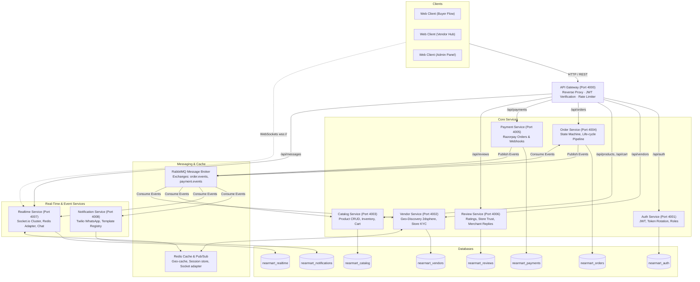
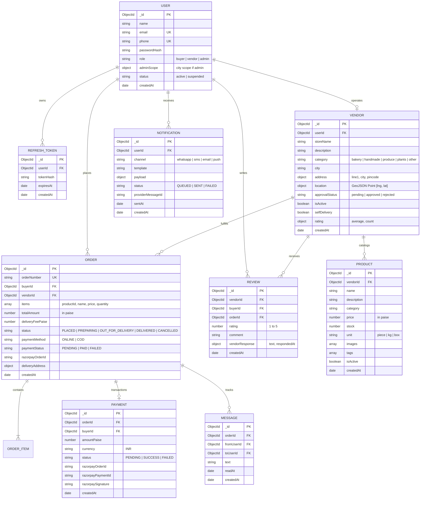

# NearMart — Hyperlocal E-Commerce Platform
### Distributed Microservices Architecture · Event-Driven Pipelines · Real-Time Tracking · Shopify Design Language

[](https://opensource.org/licenses/MIT)
[](https://nodejs.org)
[](https://react.dev)
[](https://vitejs.dev)
[](https://www.mongodb.com)
[](https://redis.io)
[](https://www.rabbitmq.com)
[](https://socket.io)

NearMart is an enterprise-grade, distributed hyperlocal commerce platform engineered to connect neighborhood artisans, bakeries, indie roasters, urban growers, and specialty makers directly with nearby consumers for rapid local delivery.

For the full technical breakdown, see **[PROJECT_DOCUMENTATION.md](./PROJECT_DOCUMENTATION.md)**.

---

## 1. System Architecture



---

## 2. Technology Stack & Tech Utilization

| Technology | Layer | Role in NearMart | Why it Was Chosen |
| :--- | :--- | :--- | :--- |
| **Node.js & Express** | Backend Services & Gateway | Powers the API Gateway and all 8 microservices | Non-blocking asynchronous I/O, lightweight footprint, robust HTTP routing ecosystem. |
| **React 19 & Vite** | Frontend Client | Drives the buyer experience, vendor workspace, and admin moderation portal | Ultra-fast HMR build speeds, component modularity, modern Hooks state model. |
| **Vanilla CSS (Shopify Design System)** | UI Styling Architecture | Defines tokens, elevations (Level 1/2/3), pill buttons, thin typography | 100% control without CSS framework overhead; strictly enforces Shopify design constraints. |
| **MongoDB & Mongoose** | Primary Persistence | Per-service isolated database instances (`nearmart_*`) | Native JSON-like document flexibility; built-in geospatial `$near` spatial index support. |
| **Redis & ioredis** | In-Memory Cache & Adapter | Caches vendor geo-queries, flushes on updates, connects Socket.io adapter | Microsecond latency, distributed pub/sub, prevents database bottlenecks during surges. |
| **RabbitMQ & amqplib** | Event Message Broker | Asynchronous decoupled message passing across microservices | Guarantees at-least-once message delivery, durable queues, prevents cascading failure. |
| **Socket.io & Redis Adapter** | Real-Time Engine | Powers live order state updates and bi-directional customer-to-vendor messaging | Room-based isolation (`order:{id}`, `user:{id}`) horizontally scalable across nodes. |
| **Razorpay SDK & Webhooks** | Payment Processing | Generates checkout orders and verifies signatures with HMAC-SHA256 | Compliant Indian payment rails (UPI, cards, netbanking) with asynchronous webhook confirmation. |
| **Twilio API** | Outbound Notifications | Dispatches automated WhatsApp and SMS template alerts to buyers and vendors | Reliable global delivery for transactional milestones (e.g., order placed, out for delivery). |
| **JWT & bcryptjs** | Authentication & Security | Stateless access tokens (15m TTL), refresh token rotation (7d TTL), salted password hashing | Industry-standard role-gated protection (`buyer`, `vendor`, `admin`) across all gateways. |
| **Docker & Docker Compose** | Infrastructure & Orchestration | Spins up containerized MongoDB, Redis, and RabbitMQ instances | One-command reproducible local and staging infrastructure setup. |

---

## 3. Entity-Relationship (ER) Diagram



---

## 4. End-to-End System Workflows

1. **Buyer Flow**:
   - Geolocation auto-detection or manual city selection (`bengaluru`, `mumbai`, `delhi`, `chennai`, etc.).
   - Nearby approved merchant discovery via MongoDB `2dsphere` spatial index and Redis query caching.
   - Merchant store menu browsing, instant cart addition with single-vendor validation.
   - Address checkout with payment choice: Razorpay online payments (with HMAC signature verification) or COD.
   - Real-time interactive order timeline tracking over direct WebSocket connections (`ws://localhost:4007`) with embedded live vendor chat.

2. **Vendor Flow**:
   - Seller Hub registration with address, GeoJSON location coordinates, and category.
   - Product catalog management with image URLs, stock controls, and pricing in paise.
   - Live 4-column Kanban order inbox (`PLACED` → `PREPARING` → `OUT_FOR_DELIVERY` → `DELIVERED`).
   - Pure CSS toggle controls for store active status and self-delivery options.
   - Review management and public merchant replies.

3. **Admin Flow**:
   - City-scoped and super-admin moderation dashboards.
   - Real-time pending merchant verification queue with approve and reject actions.
   - Platform analytics tracking gross merchandise value (GMV), active stores, and pipeline distributions.

---

## 5. Quickstart & Local Setup

```bash
# 1. Clone repository
git clone https://github.com/vijayasarvajith16/NearMarts.git
cd NearMarts

# 2. Setup environment variables
cp .env.example .env

# 3. Spin up Docker databases & message broker
docker-compose -f infra/docker-compose.yml up -d

# 4. Start Gateway and Microservices
# (Run in respective folders or via orchestrator)
cd gateway && npm install && npm run dev
cd services/auth-service && npm install && npm run dev
cd services/vendor-service && npm install && npm run dev
cd services/catalog-service && npm install && npm run dev
cd services/order-service && npm install && npm run dev
cd services/payment-service && npm install && npm run dev
cd services/review-service && npm install && npm run dev
cd services/realtime-service && npm install && npm run dev
cd services/notification-service && npm install && npm run dev

# 5. Start Client Web Application
cd client && npm install && npm run dev
```

Visit **[http://localhost:5173/](http://localhost:5173/)** to access the live platform.

### Default Super Admin Credentials
- **Email**: `admin@nearmart.com`
- **Password**: `AdminPassword123!`
- **Role**: `admin`
